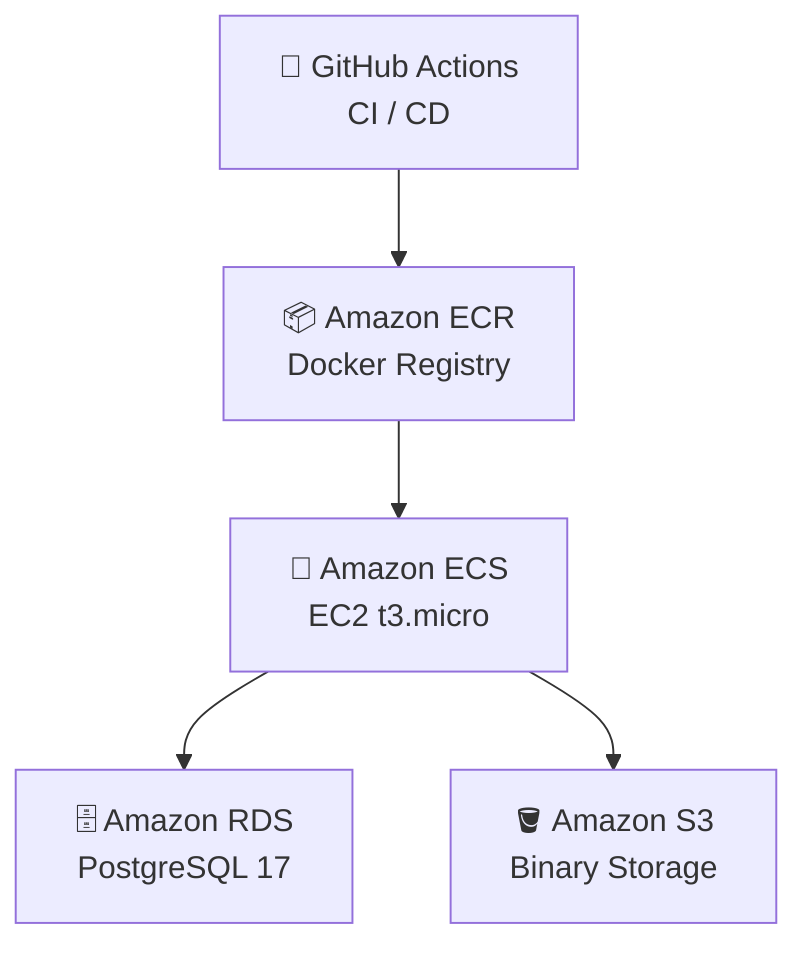

# 1-sprint-mission

# 🎮 Discodeit

> Discord를 모티브로 한 채팅 애플리케이션 백엔드 서버

---

## 🚀 배포 정보

| 항목     | 값                                          |
|--------|--------------------------------------------|
| 배포 환경  | AWS ECS (EC2 t3.micro)                     |
| 엔드포인트  | http://15.165.44.183                       |
| API 문서 | http://15.165.44.183/swagger-ui/index.html |

---

## 🛠️ 기술 스택

| 분류        | 기술                          |
|-----------|-----------------------------|
| Language  | Java 17                     |
| Framework | Spring Boot 3.5.11          |
| Database  | PostgreSQL 17 (AWS RDS)     |
| ORM       | Spring Data JPA / Hibernate |
| Storage   | AWS S3                      |
| Container | Docker / AWS ECS            |
| CI/CD     | GitHub Actions              |
| Docs      | Swagger (SpringDoc OpenAPI) |

## 🛠️ Tech Stack

### ☕ Language

### 🌱 Framework

### 🗄️ Database

### 🔗 ORM

### ☁️ Storage

### 📦 Container

### 🚀 CI/CD

### 📚 API Docs

## 🏗️ 아키텍처

